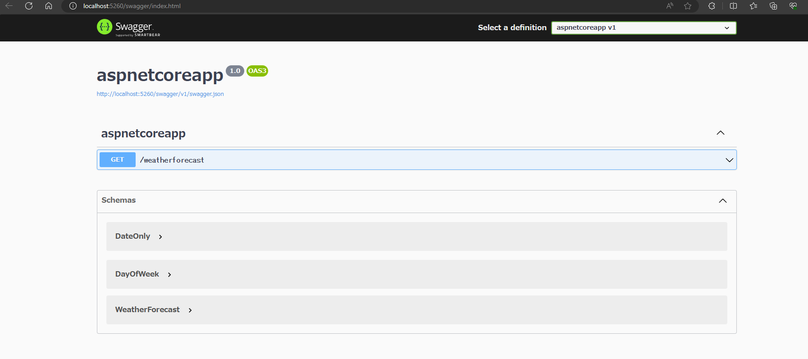

# Aspnet Core Tutorial

## 1. はじめに
MS Learnのチュートリアルをやってみる。
- 参考サイト
[MS Learn - Asp.NET Core](https://learn.microsoft.com/ja-jp/aspnet/core/getting-started/?view=aspnetcore-8.0&tabs=windows)


### 作業の開始
1. プロジェクトの作成
```powershell
dotnet new webapp -o aspnetcoreapp
```

2. プロジェクトの実行
```powershell
cd aspnetcoreapp
dotnet watch run
```

- 実行結果
